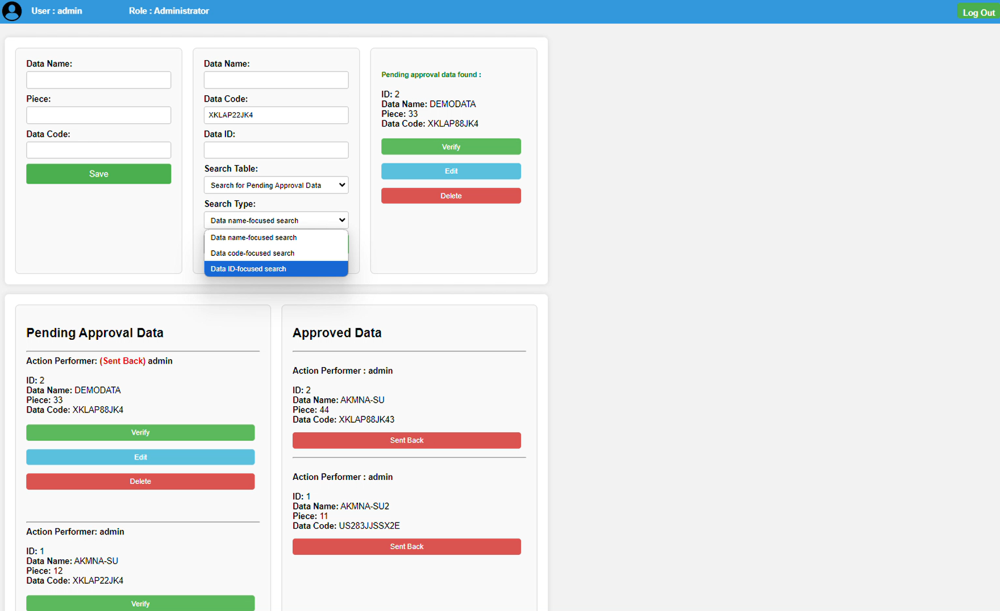
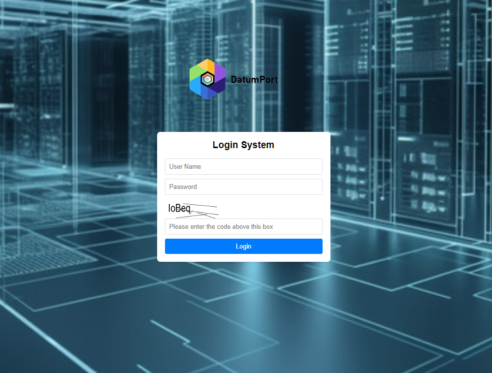
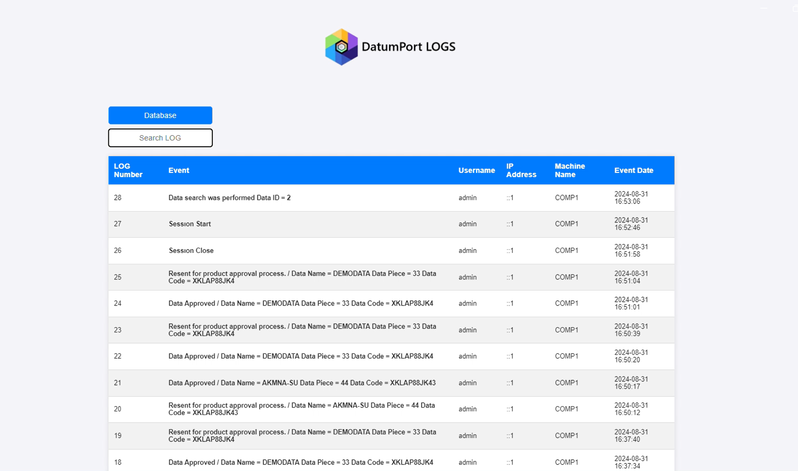
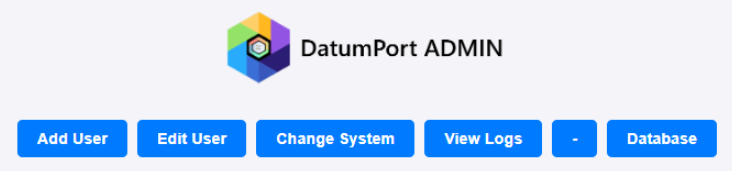

# DatumPort
 Web-based system developed for data management

## Description

DatumPort is a PHP-based data management system utilizing AJAX for dynamic interactions. It provides a structured data management solution with user roles and operates seamlessly on a local server environment without the need for external access. The system features an offline CAPTCHA system and includes a comprehensive logging system to monitor user actions and more.

## Application Screenshots

## Installation

1. **Download and Extract:**
   - Clone or download the DatumPort repository to your local machine.

2. **Setup Local Server:**
   - Ensure you have a local server environment (e.g., XAMPP, WAMP) installed.

3. **Move Source Files:**
   - Transfer the source files to your local server environment.

4. **Edit Configuration File:**
   - Edit the file styles/index_main_style_tp-1.css according to the comment on line 11.

5. **Import Database:**
   - Import the `database_map/datumport_msql.sql` file into MySQL. 
   - Additionally, detailed MySQL documentation can be found at `database_map/SQL_MAP.html`.
     
## Authors and Contributors

* Habil YILDIRIM [@YILDIRIMT](https://github.com/YILDIRIMT)

## License

This project is licensed under the [MIT License](LICENSE) - see the LICENSE file for details
